<span id="Service_flows">

## Functional flow "[POST /reg/ endpoint](https://git.54origins.com/ecosystem54_protected/agpl/01_submodules_authsubmodule54/-/tree/a8da9f5ae8d9104f73c3b698a2628968e88e10cc/docs_and_tests/dt_init.py#L16)"

```mermaid
graph TD
subgraph POST /reg/ endpoint
flow_data__post_reg_21_145["Submodule AUTH_PERMS:<br>POST /reg/"]
end
flow_data__post_reg_21_145-->__init___set_actor_114_21
subgraph POST /reg/
__init___set_actor_114_21["Submodule AUTH_PERMS:<br>Function that save actor in flask g."]
auth_view_post_114_21["Submodule AUTH_PERMS:<br>POST /reg/ endpoint"]
end
__init___set_actor_114_21-->auth_view_post_114_21
auth_view_post_114_21-->utils_get_user_sid_436_114
subgraph POST /reg/ endpoint
utils_get_user_sid_436_114["Submodule AUTH_PERMS:<br>Get user sid by qr token<br>:param qr_token: qr token<br>:return: sid"]
utils_check_if_auth_service_438_114["Submodule AUTH_PERMS:<br>Checks if service auth or not.<br>:return: boolean value. True - if service auth, False - if not"]
auth_view_registration_classic_user_446_114["Submodule AUTH_PERMS:<br>Classic registration with login/password.<br>:param data: login, password,...<br><Click to see full description>"]
end
utils_get_user_sid_436_114-->utils_check_if_auth_service_438_114
utils_check_if_auth_service_438_114-->ecdsa_lib_sign_data_531_438
ecdsa_lib_verify_signature_536_438-->auth_view_registration_classic_user_446_114
auth_view_registration_classic_user_446_114-->auth_view_check_if_from_client_service_664_446
subgraph Checks if service auth or not
ecdsa_lib_sign_data_531_438["Submodule AUTH_PERMS:<br>Sign passed data with private key using<br>fast_ecdsa library."]
ecdsa_lib_verify_signature_536_438["Submodule AUTH_PERMS:<br>Verify created for data signature with user public key.<br>:param pub_key:<br>:param...<br><Click to see full description>"]
end
ecdsa_lib_sign_data_531_438-->ecdsa_lib_verify_signature_536_438
subgraph Classic registration with login/password
auth_view_check_if_from_client_service_664_446["Submodule AUTH_PERMS:<br>Check if request was sent from client service.<br>If request came from client service - verify...<br><Click to see full description>"]
utils_validate_email_682_446["Submodule AUTH_PERMS:<br>Validate passed email value."]
utils_hash_md5_719_446["Submodule AUTH_PERMS:<br>Hash string with md5.<br>Need for hashing password and password verification<br>:param text:...<br><Click to see full description>"]
auth_view_add_default_group_746_446["Submodule AUTH_PERMS:<br>Validate default group received from client service<br>or adding auth default group.<br>:param...<br><Click to see full description>"]
end
auth_view_check_if_from_client_service_664_446-->utils_validate_email_682_446
utils_validate_email_682_446-->utils_hash_md5_719_446
utils_hash_md5_719_446-->auth_view_add_default_group_746_446
auth_view_add_default_group_746_446-->utils_get_default_user_group_405_746
subgraph Validate default group received from client service or adding auth default group
utils_get_default_user_group_405_746["Submodule AUTH_PERMS:<br>Get default user group. By default user adds in this group<br>:return: group"]
end
click dt_init_registration_26_145 "https://git.54origins.com/ecosystem54_protected/agpl/01_submodules_authsubmodule54/-/tree/a8da9f5ae8d9104f73c3b698a2628968e88e10cc/docs_and_tests/dt_init.py#L16"
click flow_data__post_reg_21_145 "https://git.54origins.com/ecosystem54_protected/agpl/01_submodules_authsubmodule54/-/tree/a8da9f5ae8d9104f73c3b698a2628968e88e10cc/docs_and_tests/flow_data.py#L109"
click __init___set_actor_114_21 "https://git.54origins.com/ecosystem54_protected/agpl/01_submodules_authsubmodule54/-/tree/a8da9f5ae8d9104f73c3b698a2628968e88e10cc/__init__.py#L19"
click utils_get_session_token_24_114 "https://git.54origins.com/ecosystem54_protected/agpl/01_submodules_authsubmodule54/-/tree/a8da9f5ae8d9104f73c3b698a2628968e88e10cc/core/utils.py#L466"
click auth_view_post_114_21 "https://git.54origins.com/ecosystem54_protected/agpl/01_submodules_authsubmodule54/-/tree/a8da9f5ae8d9104f73c3b698a2628968e88e10cc/core/auth_view.py#L429"
click utils_get_user_sid_436_114 "https://git.54origins.com/ecosystem54_protected/agpl/01_submodules_authsubmodule54/-/tree/a8da9f5ae8d9104f73c3b698a2628968e88e10cc/core/utils.py#L709"
click utils_check_if_auth_service_438_114 "https://git.54origins.com/ecosystem54_protected/agpl/01_submodules_authsubmodule54/-/tree/a8da9f5ae8d9104f73c3b698a2628968e88e10cc/core/utils.py#L524"
click ecdsa_lib_sign_data_531_438 "https://git.54origins.com/ecosystem54_protected/agpl/01_submodules_authsubmodule54/-/tree/a8da9f5ae8d9104f73c3b698a2628968e88e10cc/core/ecdsa_lib.py#L10"
click ecdsa_lib_verify_signature_536_438 "https://git.54origins.com/ecosystem54_protected/agpl/01_submodules_authsubmodule54/-/tree/a8da9f5ae8d9104f73c3b698a2628968e88e10cc/core/ecdsa_lib.py#L22"
click auth_view_registration_classic_user_446_114 "https://git.54origins.com/ecosystem54_protected/agpl/01_submodules_authsubmodule54/-/tree/a8da9f5ae8d9104f73c3b698a2628968e88e10cc/core/auth_view.py#L647"
click auth_view_check_if_from_client_service_664_446 "https://git.54origins.com/ecosystem54_protected/agpl/01_submodules_authsubmodule54/-/tree/a8da9f5ae8d9104f73c3b698a2628968e88e10cc/core/auth_view.py#L328"
click utils_validate_email_682_446 "https://git.54origins.com/ecosystem54_protected/agpl/01_submodules_authsubmodule54/-/tree/a8da9f5ae8d9104f73c3b698a2628968e88e10cc/core/utils.py#L680"
click utils_hash_md5_719_446 "https://git.54origins.com/ecosystem54_protected/agpl/01_submodules_authsubmodule54/-/tree/a8da9f5ae8d9104f73c3b698a2628968e88e10cc/core/utils.py#L724"
click auth_view_add_default_group_746_446 "https://git.54origins.com/ecosystem54_protected/agpl/01_submodules_authsubmodule54/-/tree/a8da9f5ae8d9104f73c3b698a2628968e88e10cc/core/auth_view.py#L365"
click utils_get_default_user_group_405_746 "https://git.54origins.com/ecosystem54_protected/agpl/01_submodules_authsubmodule54/-/tree/a8da9f5ae8d9104f73c3b698a2628968e88e10cc/core/utils.py#L620"

```

## Functional flow "[POST /auth/ endpoint](https://git.54origins.com/ecosystem54_protected/agpl/01_submodules_authsubmodule54/-/tree/a8da9f5ae8d9104f73c3b698a2628968e88e10cc/docs_and_tests/dt_init.py#L34)"

```mermaid
graph TD
subgraph POST /auth/ endpoint
flow_data__post_auth_39_145["Submodule AUTH_PERMS:<br>POST /auth/"]
end
flow_data__post_auth_39_145-->__init___set_actor_127_39
subgraph POST /auth/
__init___set_actor_127_39["Submodule AUTH_PERMS:<br>Function that save actor in flask g."]
utils_check_if_auth_service_127_39["Submodule AUTH_PERMS:<br>Checks if service auth or not.<br>:return: boolean value. True - if service auth, False - if not"]
auth_view_authorization_classic_user_127_39["Submodule AUTH_PERMS:<br>Authorization classic user.<br>:param data: dictionary with actor_type,email and...<br><Click to see full description>"]
utils_get_user_sid_127_39["Submodule AUTH_PERMS:<br>Get user sid by qr token<br>:param qr_token: qr token<br>:return: sid"]
actor_get_127_39["Submodule AUTH_PERMS:<br>Get Actors<br>:return: [] or [Actor(actor) for actor in actors]"]
end
__init___set_actor_127_39-->utils_check_if_auth_service_127_39
utils_check_if_auth_service_127_39-->ecdsa_lib_sign_data_531_127
ecdsa_lib_verify_signature_536_127-->auth_view_authorization_classic_user_127_39
auth_view_authorization_classic_user_127_39-->auth_view_check_if_from_client_service_1426_127
utils_create_session_1495_127-->utils_get_user_sid_127_39
utils_get_user_sid_127_39-->actor_get_127_39
subgraph Checks if service auth or not
ecdsa_lib_sign_data_531_127["Submodule AUTH_PERMS:<br>Sign passed data with private key using<br>fast_ecdsa library."]
ecdsa_lib_verify_signature_536_127["Submodule AUTH_PERMS:<br>Verify created for data signature with user public key.<br>:param pub_key:<br>:param...<br><Click to see full description>"]
end
ecdsa_lib_sign_data_531_127-->ecdsa_lib_verify_signature_536_127
subgraph Authorization classic user
auth_view_check_if_from_client_service_1426_127["Submodule AUTH_PERMS:<br>Check if request was sent from client service.<br>If request came from client service - verify...<br><Click to see full description>"]
utils_validate_email_1441_127["Submodule AUTH_PERMS:<br>Validate passed email value."]
utils_hash_md5_1460_127["Submodule AUTH_PERMS:<br>Hash string with md5.<br>Need for hashing password and password verification<br>:param text:...<br><Click to see full description>"]
utils_get_apt54_1466_127["Submodule AUTH_PERMS:<br>Send POST request on auth for getting apt54<br>:param uuid: user uuid<br>:return: apt54 or None"]
ecdsa_lib_sign_data_357_1466["Submodule AUTH_PERMS:<br>Sign passed data with private key using<br>fast_ecdsa library."]
utils_verify_apt54_365_1466["Submodule AUTH_PERMS:<br>APT54 verification that user received it from auth and didn't change any data<br>:param apt54: user...<br><Click to see full description>"]
ecdsa_lib_verify_signature_519_365["Submodule AUTH_PERMS:<br>Verify created for data signature with user public key.<br>:param pub_key:<br>:param...<br><Click to see full description>"]
utils_create_session_1495_127["Submodule AUTH_PERMS:<br>Session generation on service<br>:param apt54: dict. User's apt54<br>:param auxiliary_token: string...<br><Click to see full description>"]
end
auth_view_check_if_from_client_service_1426_127-->utils_validate_email_1441_127
utils_validate_email_1441_127-->utils_hash_md5_1460_127
utils_hash_md5_1460_127-->utils_get_apt54_1466_127
utils_get_apt54_1466_127-->ecdsa_lib_sign_data_357_1466
ecdsa_lib_sign_data_357_1466-->utils_verify_apt54_365_1466
utils_verify_apt54_365_1466-->ecdsa_lib_verify_signature_519_365
ecdsa_lib_verify_signature_519_365-->utils_create_session_1495_127
utils_create_session_1495_127-->actor_get_423_1495
subgraph Session generation on service
actor_get_423_1495["Submodule AUTH_PERMS:<br>Get Actors<br>:return: [] or [Actor(actor) for actor in actors]"]
ecdsa_lib_verify_signature_164_423["Submodule AUTH_PERMS:<br>Verify created for data signature with user public key.<br>:param pub_key:<br>:param...<br><Click to see full description>"]
utils_generate_random_string_433_1495["Submodule AUTH_PERMS:<br>Generates random string.<br>:param charset: string of characters for generating<br>:param length:...<br><Click to see full description>"]
utils_get_user_sid_442_1495["Submodule AUTH_PERMS:<br>Get user sid by qr token<br>:param qr_token: qr token<br>:return: sid"]
end
actor_get_423_1495-->ecdsa_lib_verify_signature_164_423
ecdsa_lib_verify_signature_164_423-->utils_generate_random_string_433_1495
utils_generate_random_string_433_1495-->utils_get_user_sid_442_1495
click dt_init_authorization_flow_42_145 "https://git.54origins.com/ecosystem54_protected/agpl/01_submodules_authsubmodule54/-/tree/a8da9f5ae8d9104f73c3b698a2628968e88e10cc/docs_and_tests/dt_init.py#L34"
click flow_data__post_auth_39_145 "https://git.54origins.com/ecosystem54_protected/agpl/01_submodules_authsubmodule54/-/tree/a8da9f5ae8d9104f73c3b698a2628968e88e10cc/docs_and_tests/flow_data.py#L120"
click __init___set_actor_127_39 "https://git.54origins.com/ecosystem54_protected/agpl/01_submodules_authsubmodule54/-/tree/a8da9f5ae8d9104f73c3b698a2628968e88e10cc/__init__.py#L19"
click utils_get_session_token_24_127 "https://git.54origins.com/ecosystem54_protected/agpl/01_submodules_authsubmodule54/-/tree/a8da9f5ae8d9104f73c3b698a2628968e88e10cc/core/utils.py#L466"
click utils_check_if_auth_service_127_39 "https://git.54origins.com/ecosystem54_protected/agpl/01_submodules_authsubmodule54/-/tree/a8da9f5ae8d9104f73c3b698a2628968e88e10cc/core/utils.py#L524"
click ecdsa_lib_sign_data_531_127 "https://git.54origins.com/ecosystem54_protected/agpl/01_submodules_authsubmodule54/-/tree/a8da9f5ae8d9104f73c3b698a2628968e88e10cc/core/ecdsa_lib.py#L10"
click ecdsa_lib_verify_signature_536_127 "https://git.54origins.com/ecosystem54_protected/agpl/01_submodules_authsubmodule54/-/tree/a8da9f5ae8d9104f73c3b698a2628968e88e10cc/core/ecdsa_lib.py#L22"
click auth_view_authorization_classic_user_127_39 "https://git.54origins.com/ecosystem54_protected/agpl/01_submodules_authsubmodule54/-/tree/a8da9f5ae8d9104f73c3b698a2628968e88e10cc/core/auth_view.py#L1414"
click auth_view_check_if_from_client_service_1426_127 "https://git.54origins.com/ecosystem54_protected/agpl/01_submodules_authsubmodule54/-/tree/a8da9f5ae8d9104f73c3b698a2628968e88e10cc/core/auth_view.py#L328"
click utils_validate_email_1441_127 "https://git.54origins.com/ecosystem54_protected/agpl/01_submodules_authsubmodule54/-/tree/a8da9f5ae8d9104f73c3b698a2628968e88e10cc/core/utils.py#L680"
click utils_hash_md5_1460_127 "https://git.54origins.com/ecosystem54_protected/agpl/01_submodules_authsubmodule54/-/tree/a8da9f5ae8d9104f73c3b698a2628968e88e10cc/core/utils.py#L724"
click utils_get_apt54_1466_127 "https://git.54origins.com/ecosystem54_protected/agpl/01_submodules_authsubmodule54/-/tree/a8da9f5ae8d9104f73c3b698a2628968e88e10cc/core/utils.py#L345"
click ecdsa_lib_sign_data_357_1466 "https://git.54origins.com/ecosystem54_protected/agpl/01_submodules_authsubmodule54/-/tree/a8da9f5ae8d9104f73c3b698a2628968e88e10cc/core/ecdsa_lib.py#L10"
click utils_verify_apt54_365_1466 "https://git.54origins.com/ecosystem54_protected/agpl/01_submodules_authsubmodule54/-/tree/a8da9f5ae8d9104f73c3b698a2628968e88e10cc/core/utils.py#L505"
click ecdsa_lib_verify_signature_519_365 "https://git.54origins.com/ecosystem54_protected/agpl/01_submodules_authsubmodule54/-/tree/a8da9f5ae8d9104f73c3b698a2628968e88e10cc/core/ecdsa_lib.py#L22"
click utils_create_session_1495_127 "https://git.54origins.com/ecosystem54_protected/agpl/01_submodules_authsubmodule54/-/tree/a8da9f5ae8d9104f73c3b698a2628968e88e10cc/core/utils.py#L408"
click actor_get_423_1495 "https://git.54origins.com/ecosystem54_protected/agpl/01_submodules_authsubmodule54/-/tree/a8da9f5ae8d9104f73c3b698a2628968e88e10cc/core/actor.py#L141"
click ecdsa_lib_verify_signature_164_423 "https://git.54origins.com/ecosystem54_protected/agpl/01_submodules_authsubmodule54/-/tree/a8da9f5ae8d9104f73c3b698a2628968e88e10cc/core/ecdsa_lib.py#L22"
click utils_generate_random_string_433_1495 "https://git.54origins.com/ecosystem54_protected/agpl/01_submodules_authsubmodule54/-/tree/a8da9f5ae8d9104f73c3b698a2628968e88e10cc/core/utils.py#L397"
click utils_get_user_sid_442_1495 "https://git.54origins.com/ecosystem54_protected/agpl/01_submodules_authsubmodule54/-/tree/a8da9f5ae8d9104f73c3b698a2628968e88e10cc/core/utils.py#L709"
click utils_get_user_sid_127_39 "https://git.54origins.com/ecosystem54_protected/agpl/01_submodules_authsubmodule54/-/tree/a8da9f5ae8d9104f73c3b698a2628968e88e10cc/core/utils.py#L709"
click actor_get_127_39 "https://git.54origins.com/ecosystem54_protected/agpl/01_submodules_authsubmodule54/-/tree/a8da9f5ae8d9104f73c3b698a2628968e88e10cc/core/actor.py#L141"
click ecdsa_lib_verify_signature_164_127 "https://git.54origins.com/ecosystem54_protected/agpl/01_submodules_authsubmodule54/-/tree/a8da9f5ae8d9104f73c3b698a2628968e88e10cc/core/ecdsa_lib.py#L22"

```



## Functional flow "[POST /actor/ endpoint](https://git.54origins.com/ecosystem54_protected/agpl/01_submodules_authsubmodule54/-/tree/a8da9f5ae8d9104f73c3b698a2628968e88e10cc/docs_and_tests/dt_init.py#L49)"

```mermaid
graph TD
subgraph POST /actor/ endpoint
flow_data__post_create_actor_54_145["Submodule AUTH_PERMS:<br>Create new user"]
end
flow_data__post_create_actor_54_145-->flow_data_get_signature_92_54
subgraph Create new user
flow_data_get_signature_92_54["Submodule AUTH_PERMS:<br>Get signature"]
flow_data__get_session_token_98_54["Submodule AUTH_PERMS:<br>Get current session token"]
__init___set_actor_93_54["Submodule AUTH_PERMS:<br>Function that save actor in flask g."]
decorators_inner_93_54["Submodule AUTH_PERMS:<br>Decorator service only"]
end
flow_data_get_signature_92_54-->ecdsa_lib_sign_data_298_92
ecdsa_lib_sign_data_298_92-->flow_data__get_session_token_98_54
flow_data__get_session_token_98_54-->__init___set_actor_93_54
__init___set_actor_93_54-->decorators_inner_93_54
decorators_inner_93_54-->actor_view_post_272_93
subgraph Get signature
ecdsa_lib_sign_data_298_92["Submodule AUTH_PERMS:<br>Sign passed data with private key using<br>fast_ecdsa library."]
end
subgraph Decorator service only
actor_view_post_272_93["Submodule AUTH_PERMS:<br>Create actor. Only for auth service."]
end
actor_view_post_272_93-->ecdsa_lib_verify_signature_58_272
subgraph Create actor. Only for auth service.
ecdsa_lib_verify_signature_58_272["Submodule AUTH_PERMS:<br>Verify created for data signature with user public key.<br>:param pub_key:<br>:param...<br><Click to see full description>"]
actor_actions_execute_61_272["Submodule AUTH_PERMS:<br>Actor Actions"]
actor_get_62_272["Submodule AUTH_PERMS:<br>Get Actors<br>:return: [] or [Actor(actor) for actor in actors]"]
service_view_send_callback_62_272["Submodule AUTH_PERMS:<br>Send callback request on auth service, that information was updated on your service."]
end
ecdsa_lib_verify_signature_58_272-->actor_actions_execute_61_272
actor_actions_execute_61_272-->actor_get_62_272
actor_get_62_272-->service_view_send_callback_62_272
service_view_send_callback_62_272-->service_view__send_request_424_62
subgraph Send callback request on auth service, that information was updated on your service.
service_view__send_request_424_62["Submodule AUTH_PERMS:<br>General function for sending request on service. Can be rewrite if you need<br>:param data: dict....<br><Click to see full description>"]
end
click dt_init_create_actor_flow_57_145 "https://git.54origins.com/ecosystem54_protected/agpl/01_submodules_authsubmodule54/-/tree/a8da9f5ae8d9104f73c3b698a2628968e88e10cc/docs_and_tests/dt_init.py#L49"
click flow_data__post_create_actor_54_145 "https://git.54origins.com/ecosystem54_protected/agpl/01_submodules_authsubmodule54/-/tree/a8da9f5ae8d9104f73c3b698a2628968e88e10cc/docs_and_tests/flow_data.py#L86"
click flow_data_get_signature_92_54 "https://git.54origins.com/ecosystem54_protected/agpl/01_submodules_authsubmodule54/-/tree/a8da9f5ae8d9104f73c3b698a2628968e88e10cc/docs_and_tests/flow_data.py#L293"
click ecdsa_lib_sign_data_298_92 "https://git.54origins.com/ecosystem54_protected/agpl/01_submodules_authsubmodule54/-/tree/a8da9f5ae8d9104f73c3b698a2628968e88e10cc/core/ecdsa_lib.py#L10"
click flow_data__get_session_token_98_54 "https://git.54origins.com/ecosystem54_protected/agpl/01_submodules_authsubmodule54/-/tree/a8da9f5ae8d9104f73c3b698a2628968e88e10cc/docs_and_tests/flow_data.py#L74"
click __init___set_actor_93_54 "https://git.54origins.com/ecosystem54_protected/agpl/01_submodules_authsubmodule54/-/tree/a8da9f5ae8d9104f73c3b698a2628968e88e10cc/__init__.py#L19"
click utils_get_session_token_24_93 "https://git.54origins.com/ecosystem54_protected/agpl/01_submodules_authsubmodule54/-/tree/a8da9f5ae8d9104f73c3b698a2628968e88e10cc/core/utils.py#L466"
click actor_get_by_session_27_93 "https://git.54origins.com/ecosystem54_protected/agpl/01_submodules_authsubmodule54/-/tree/a8da9f5ae8d9104f73c3b698a2628968e88e10cc/core/actor.py#L190"
click ecdsa_lib_verify_signature_212_27 "https://git.54origins.com/ecosystem54_protected/agpl/01_submodules_authsubmodule54/-/tree/a8da9f5ae8d9104f73c3b698a2628968e88e10cc/core/ecdsa_lib.py#L22"
click decorators_inner_93_54 "https://git.54origins.com/ecosystem54_protected/agpl/01_submodules_authsubmodule54/-/tree/a8da9f5ae8d9104f73c3b698a2628968e88e10cc/core/decorators.py#L254"
click actor_view_post_272_93 "https://git.54origins.com/ecosystem54_protected/agpl/01_submodules_authsubmodule54/-/tree/a8da9f5ae8d9104f73c3b698a2628968e88e10cc/core/actor_view.py#L51"
click ecdsa_lib_verify_signature_58_272 "https://git.54origins.com/ecosystem54_protected/agpl/01_submodules_authsubmodule54/-/tree/a8da9f5ae8d9104f73c3b698a2628968e88e10cc/core/ecdsa_lib.py#L22"
click actor_actions_execute_61_272 "https://git.54origins.com/ecosystem54_protected/agpl/01_submodules_authsubmodule54/-/tree/a8da9f5ae8d9104f73c3b698a2628968e88e10cc/core/actions/actor_actions.py#L40"
click actor_get_62_272 "https://git.54origins.com/ecosystem54_protected/agpl/01_submodules_authsubmodule54/-/tree/a8da9f5ae8d9104f73c3b698a2628968e88e10cc/core/actor.py#L141"
click service_view_send_callback_62_272 "https://git.54origins.com/ecosystem54_protected/agpl/01_submodules_authsubmodule54/-/tree/a8da9f5ae8d9104f73c3b698a2628968e88e10cc/core/service_view.py#L418"
click service_view__send_request_424_62 "https://git.54origins.com/ecosystem54_protected/agpl/01_submodules_authsubmodule54/-/tree/a8da9f5ae8d9104f73c3b698a2628968e88e10cc/core/service_view.py#L187"
click utils_apt54_expired_206_424 "https://git.54origins.com/ecosystem54_protected/agpl/01_submodules_authsubmodule54/-/tree/a8da9f5ae8d9104f73c3b698a2628968e88e10cc/core/utils.py#L541"
click ecdsa_lib_sign_data_220_424 "https://git.54origins.com/ecosystem54_protected/agpl/01_submodules_authsubmodule54/-/tree/a8da9f5ae8d9104f73c3b698a2628968e88e10cc/core/ecdsa_lib.py#L10"

```

## Functional flow "[POST /actor/ endpoint](https://git.54origins.com/ecosystem54_protected/agpl/01_submodules_authsubmodule54/-/tree/a8da9f5ae8d9104f73c3b698a2628968e88e10cc/docs_and_tests/dt_init.py#L64)"

```mermaid
graph TD
subgraph POST /actor/ endpoint
flow_data__post_create_actor_69_145["Submodule AUTH_PERMS:<br>Create new user"]
end
flow_data__post_create_actor_69_145-->flow_data_get_signature_92_69
subgraph Create new user
flow_data_get_signature_92_69["Submodule AUTH_PERMS:<br>Get signature"]
flow_data__get_session_token_98_69["Submodule AUTH_PERMS:<br>Get current session token"]
__init___set_actor_93_69["Submodule AUTH_PERMS:<br>Function that save actor in flask g."]
decorators_inner_93_69["Submodule AUTH_PERMS:<br>Decorator service only"]
end
flow_data_get_signature_92_69-->ecdsa_lib_sign_data_298_92
ecdsa_lib_sign_data_298_92-->flow_data__get_session_token_98_69
flow_data__get_session_token_98_69-->__init___set_actor_93_69
__init___set_actor_93_69-->decorators_inner_93_69
decorators_inner_93_69-->actor_view_post_272_93
subgraph Get signature
ecdsa_lib_sign_data_298_92["Submodule AUTH_PERMS:<br>Sign passed data with private key using<br>fast_ecdsa library."]
end
subgraph Decorator service only
actor_view_post_272_93["Submodule AUTH_PERMS:<br>Create actor. Only for auth service."]
end
actor_view_post_272_93-->ecdsa_lib_verify_signature_58_272
subgraph Create actor. Only for auth service.
ecdsa_lib_verify_signature_58_272["Submodule AUTH_PERMS:<br>Verify created for data signature with user public key.<br>:param pub_key:<br>:param...<br><Click to see full description>"]
actor_actions_execute_61_272["Submodule AUTH_PERMS:<br>Actor Actions"]
actor_get_62_272["Submodule AUTH_PERMS:<br>Get Actors<br>:return: [] or [Actor(actor) for actor in actors]"]
service_view_send_callback_62_272["Submodule AUTH_PERMS:<br>Send callback request on auth service, that information was updated on your service."]
end
ecdsa_lib_verify_signature_58_272-->actor_actions_execute_61_272
actor_actions_execute_61_272-->actor_get_62_272
actor_get_62_272-->service_view_send_callback_62_272
service_view_send_callback_62_272-->service_view__send_request_424_62
subgraph Send callback request on auth service, that information was updated on your service.
service_view__send_request_424_62["Submodule AUTH_PERMS:<br>General function for sending request on service. Can be rewrite if you need<br>:param data: dict....<br><Click to see full description>"]
end
click dt_init_create_actor_flow_72_145 "https://git.54origins.com/ecosystem54_protected/agpl/01_submodules_authsubmodule54/-/tree/a8da9f5ae8d9104f73c3b698a2628968e88e10cc/docs_and_tests/dt_init.py#L64"
click flow_data__post_create_actor_69_145 "https://git.54origins.com/ecosystem54_protected/agpl/01_submodules_authsubmodule54/-/tree/a8da9f5ae8d9104f73c3b698a2628968e88e10cc/docs_and_tests/flow_data.py#L86"
click flow_data_get_signature_92_69 "https://git.54origins.com/ecosystem54_protected/agpl/01_submodules_authsubmodule54/-/tree/a8da9f5ae8d9104f73c3b698a2628968e88e10cc/docs_and_tests/flow_data.py#L293"
click ecdsa_lib_sign_data_298_92 "https://git.54origins.com/ecosystem54_protected/agpl/01_submodules_authsubmodule54/-/tree/a8da9f5ae8d9104f73c3b698a2628968e88e10cc/core/ecdsa_lib.py#L10"
click flow_data__get_session_token_98_69 "https://git.54origins.com/ecosystem54_protected/agpl/01_submodules_authsubmodule54/-/tree/a8da9f5ae8d9104f73c3b698a2628968e88e10cc/docs_and_tests/flow_data.py#L74"
click __init___set_actor_93_69 "https://git.54origins.com/ecosystem54_protected/agpl/01_submodules_authsubmodule54/-/tree/a8da9f5ae8d9104f73c3b698a2628968e88e10cc/__init__.py#L19"
click utils_get_session_token_24_93 "https://git.54origins.com/ecosystem54_protected/agpl/01_submodules_authsubmodule54/-/tree/a8da9f5ae8d9104f73c3b698a2628968e88e10cc/core/utils.py#L466"
click actor_get_by_session_27_93 "https://git.54origins.com/ecosystem54_protected/agpl/01_submodules_authsubmodule54/-/tree/a8da9f5ae8d9104f73c3b698a2628968e88e10cc/core/actor.py#L190"
click ecdsa_lib_verify_signature_212_27 "https://git.54origins.com/ecosystem54_protected/agpl/01_submodules_authsubmodule54/-/tree/a8da9f5ae8d9104f73c3b698a2628968e88e10cc/core/ecdsa_lib.py#L22"
click decorators_inner_93_69 "https://git.54origins.com/ecosystem54_protected/agpl/01_submodules_authsubmodule54/-/tree/a8da9f5ae8d9104f73c3b698a2628968e88e10cc/core/decorators.py#L254"
click actor_view_post_272_93 "https://git.54origins.com/ecosystem54_protected/agpl/01_submodules_authsubmodule54/-/tree/a8da9f5ae8d9104f73c3b698a2628968e88e10cc/core/actor_view.py#L51"
click ecdsa_lib_verify_signature_58_272 "https://git.54origins.com/ecosystem54_protected/agpl/01_submodules_authsubmodule54/-/tree/a8da9f5ae8d9104f73c3b698a2628968e88e10cc/core/ecdsa_lib.py#L22"
click actor_actions_execute_61_272 "https://git.54origins.com/ecosystem54_protected/agpl/01_submodules_authsubmodule54/-/tree/a8da9f5ae8d9104f73c3b698a2628968e88e10cc/core/actions/actor_actions.py#L40"
click actor_get_62_272 "https://git.54origins.com/ecosystem54_protected/agpl/01_submodules_authsubmodule54/-/tree/a8da9f5ae8d9104f73c3b698a2628968e88e10cc/core/actor.py#L141"
click service_view_send_callback_62_272 "https://git.54origins.com/ecosystem54_protected/agpl/01_submodules_authsubmodule54/-/tree/a8da9f5ae8d9104f73c3b698a2628968e88e10cc/core/service_view.py#L418"
click service_view__send_request_424_62 "https://git.54origins.com/ecosystem54_protected/agpl/01_submodules_authsubmodule54/-/tree/a8da9f5ae8d9104f73c3b698a2628968e88e10cc/core/service_view.py#L187"
click utils_apt54_expired_206_424 "https://git.54origins.com/ecosystem54_protected/agpl/01_submodules_authsubmodule54/-/tree/a8da9f5ae8d9104f73c3b698a2628968e88e10cc/core/utils.py#L541"
click ecdsa_lib_sign_data_220_424 "https://git.54origins.com/ecosystem54_protected/agpl/01_submodules_authsubmodule54/-/tree/a8da9f5ae8d9104f73c3b698a2628968e88e10cc/core/ecdsa_lib.py#L10"

```

## Functional flow "[POST /update/actor/ endpoint](https://git.54origins.com/ecosystem54_protected/agpl/01_submodules_authsubmodule54/-/tree/a8da9f5ae8d9104f73c3b698a2628968e88e10cc/docs_and_tests/dt_init.py#L79)"

```mermaid
graph TD
subgraph POST /update/actor/ endpoint
flow_data__update_actor_data_84_145["Submodule AUTH_PERMS:<br>POST Update actor"]
end
flow_data__update_actor_data_84_145-->flow_data_get_signature_198_84
subgraph Update actor
flow_data_get_signature_198_84["Submodule AUTH_PERMS:<br>Get signature"]
flow_data__get_session_token_205_84["Submodule AUTH_PERMS:<br>Get current session token"]
__init___set_actor_200_84["Submodule AUTH_PERMS:<br>Function that save actor in flask g."]
decorators_inner_200_84["Submodule AUTH_PERMS:<br>Decorator service only"]
end
flow_data_get_signature_198_84-->ecdsa_lib_sign_data_298_198
ecdsa_lib_sign_data_298_198-->flow_data__get_session_token_205_84
flow_data__get_session_token_205_84-->__init___set_actor_200_84
__init___set_actor_200_84-->decorators_inner_200_84
decorators_inner_200_84-->actor_view_put_272_200
subgraph Get signature
ecdsa_lib_sign_data_298_198["Submodule AUTH_PERMS:<br>Sign passed data with private key using<br>fast_ecdsa library."]
end
subgraph Decorator service only
actor_view_put_272_200["Submodule AUTH_PERMS:<br>Update actor. Only for auth service."]
end
actor_view_put_272_200-->ecdsa_lib_verify_signature_75_272
subgraph Update actor. Only for auth service.
ecdsa_lib_verify_signature_75_272["Submodule AUTH_PERMS:<br>Verify created for data signature with user public key.<br>:param pub_key:<br>:param...<br><Click to see full description>"]
actor_actions_execute_77_272["Submodule AUTH_PERMS:<br>Actor Actions"]
actor_get_79_272["Submodule AUTH_PERMS:<br>Get Actors<br>:return: [] or [Actor(actor) for actor in actors]"]
service_view_send_callback_79_272["Submodule AUTH_PERMS:<br>Send callback request on auth service, that information was updated on your service."]
end
ecdsa_lib_verify_signature_75_272-->actor_actions_execute_77_272
actor_actions_execute_77_272-->actor_get_79_272
actor_get_79_272-->service_view_send_callback_79_272
service_view_send_callback_79_272-->service_view__send_request_424_79
subgraph Send callback request on auth service, that information was updated on your service.
service_view__send_request_424_79["Submodule AUTH_PERMS:<br>General function for sending request on service. Can be rewrite if you need<br>:param data: dict....<br><Click to see full description>"]
end
click dt_init_update_actor_88_145 "https://git.54origins.com/ecosystem54_protected/agpl/01_submodules_authsubmodule54/-/tree/a8da9f5ae8d9104f73c3b698a2628968e88e10cc/docs_and_tests/dt_init.py#L79"
click flow_data__update_actor_data_84_145 "https://git.54origins.com/ecosystem54_protected/agpl/01_submodules_authsubmodule54/-/tree/a8da9f5ae8d9104f73c3b698a2628968e88e10cc/docs_and_tests/flow_data.py#L192"
click flow_data_get_signature_198_84 "https://git.54origins.com/ecosystem54_protected/agpl/01_submodules_authsubmodule54/-/tree/a8da9f5ae8d9104f73c3b698a2628968e88e10cc/docs_and_tests/flow_data.py#L293"
click ecdsa_lib_sign_data_298_198 "https://git.54origins.com/ecosystem54_protected/agpl/01_submodules_authsubmodule54/-/tree/a8da9f5ae8d9104f73c3b698a2628968e88e10cc/core/ecdsa_lib.py#L10"
click flow_data__get_session_token_205_84 "https://git.54origins.com/ecosystem54_protected/agpl/01_submodules_authsubmodule54/-/tree/a8da9f5ae8d9104f73c3b698a2628968e88e10cc/docs_and_tests/flow_data.py#L74"
click __init___set_actor_200_84 "https://git.54origins.com/ecosystem54_protected/agpl/01_submodules_authsubmodule54/-/tree/a8da9f5ae8d9104f73c3b698a2628968e88e10cc/__init__.py#L19"
click utils_get_session_token_24_200 "https://git.54origins.com/ecosystem54_protected/agpl/01_submodules_authsubmodule54/-/tree/a8da9f5ae8d9104f73c3b698a2628968e88e10cc/core/utils.py#L466"
click actor_get_by_session_27_200 "https://git.54origins.com/ecosystem54_protected/agpl/01_submodules_authsubmodule54/-/tree/a8da9f5ae8d9104f73c3b698a2628968e88e10cc/core/actor.py#L190"
click ecdsa_lib_verify_signature_212_27 "https://git.54origins.com/ecosystem54_protected/agpl/01_submodules_authsubmodule54/-/tree/a8da9f5ae8d9104f73c3b698a2628968e88e10cc/core/ecdsa_lib.py#L22"
click decorators_inner_200_84 "https://git.54origins.com/ecosystem54_protected/agpl/01_submodules_authsubmodule54/-/tree/a8da9f5ae8d9104f73c3b698a2628968e88e10cc/core/decorators.py#L254"
click actor_view_put_272_200 "https://git.54origins.com/ecosystem54_protected/agpl/01_submodules_authsubmodule54/-/tree/a8da9f5ae8d9104f73c3b698a2628968e88e10cc/core/actor_view.py#L68"
click ecdsa_lib_verify_signature_75_272 "https://git.54origins.com/ecosystem54_protected/agpl/01_submodules_authsubmodule54/-/tree/a8da9f5ae8d9104f73c3b698a2628968e88e10cc/core/ecdsa_lib.py#L22"
click actor_actions_execute_77_272 "https://git.54origins.com/ecosystem54_protected/agpl/01_submodules_authsubmodule54/-/tree/a8da9f5ae8d9104f73c3b698a2628968e88e10cc/core/actions/actor_actions.py#L40"
click actor_get_79_272 "https://git.54origins.com/ecosystem54_protected/agpl/01_submodules_authsubmodule54/-/tree/a8da9f5ae8d9104f73c3b698a2628968e88e10cc/core/actor.py#L141"
click service_view_send_callback_79_272 "https://git.54origins.com/ecosystem54_protected/agpl/01_submodules_authsubmodule54/-/tree/a8da9f5ae8d9104f73c3b698a2628968e88e10cc/core/service_view.py#L418"
click service_view__send_request_424_79 "https://git.54origins.com/ecosystem54_protected/agpl/01_submodules_authsubmodule54/-/tree/a8da9f5ae8d9104f73c3b698a2628968e88e10cc/core/service_view.py#L187"
click utils_apt54_expired_206_424 "https://git.54origins.com/ecosystem54_protected/agpl/01_submodules_authsubmodule54/-/tree/a8da9f5ae8d9104f73c3b698a2628968e88e10cc/core/utils.py#L541"
click ecdsa_lib_sign_data_220_424 "https://git.54origins.com/ecosystem54_protected/agpl/01_submodules_authsubmodule54/-/tree/a8da9f5ae8d9104f73c3b698a2628968e88e10cc/core/ecdsa_lib.py#L10"

```

## Functional flow "[POST /permaction/actor/ endpoint](https://git.54origins.com/ecosystem54_protected/agpl/01_submodules_authsubmodule54/-/tree/a8da9f5ae8d9104f73c3b698a2628968e88e10cc/docs_and_tests/dt_init.py#L95)"

```mermaid
graph TD
subgraph POST /permaction/actor/ endpoint
flow_data__post_perm_actor_100_145["Submodule AUTH_PERMS:<br>POST /permaction/actor/ endpoint"]
end
flow_data__post_perm_actor_100_145-->flow_data_get_signature_283_100
subgraph POST /permaction/actor/ endpoint
flow_data_get_signature_283_100["Submodule AUTH_PERMS:<br>Get signature"]
flow_data__get_session_token_289_100["Submodule AUTH_PERMS:<br>Get current session token"]
__init___set_actor_284_100["Submodule AUTH_PERMS:<br>Function that save actor in flask g."]
decorators_inner_284_100["Submodule AUTH_PERMS:<br>Decorator service only"]
end
flow_data_get_signature_283_100-->ecdsa_lib_sign_data_298_283
ecdsa_lib_sign_data_298_283-->flow_data__get_session_token_289_100
flow_data__get_session_token_289_100-->__init___set_actor_284_100
__init___set_actor_284_100-->decorators_inner_284_100
decorators_inner_284_100-->permaction_view_post_272_284
subgraph Get signature
ecdsa_lib_sign_data_298_283["Submodule AUTH_PERMS:<br>Sign passed data with private key using<br>fast_ecdsa library."]
end
subgraph Decorator service only
permaction_view_post_272_284["Submodule AUTH_PERMS:<br>Update permactions for user"]
end
permaction_view_post_272_284-->ecdsa_lib_verify_signature_41_272
subgraph Update permactions for user
ecdsa_lib_verify_signature_41_272["Submodule AUTH_PERMS:<br>Verify created for data signature with user public key.<br>:param pub_key:<br>:param...<br><Click to see full description>"]
actor_get_49_272["Submodule AUTH_PERMS:<br>Get Actors<br>:return: [] or [Actor(actor) for actor in actors]"]
service_view_send_callback_49_272["Submodule AUTH_PERMS:<br>Send callback request on auth service, that information was updated on your service."]
end
ecdsa_lib_verify_signature_41_272-->actor_get_49_272
actor_get_49_272-->service_view_send_callback_49_272
service_view_send_callback_49_272-->service_view__send_request_424_49
subgraph Send callback request on auth service, that information was updated on your service.
service_view__send_request_424_49["Submodule AUTH_PERMS:<br>General function for sending request on service. Can be rewrite if you need<br>:param data: dict....<br><Click to see full description>"]
end
click dt_init_post_set_permaction_actor_104_145 "https://git.54origins.com/ecosystem54_protected/agpl/01_submodules_authsubmodule54/-/tree/a8da9f5ae8d9104f73c3b698a2628968e88e10cc/docs_and_tests/dt_init.py#L95"
click flow_data__post_perm_actor_100_145 "https://git.54origins.com/ecosystem54_protected/agpl/01_submodules_authsubmodule54/-/tree/a8da9f5ae8d9104f73c3b698a2628968e88e10cc/docs_and_tests/flow_data.py#L270"
click flow_data_get_signature_283_100 "https://git.54origins.com/ecosystem54_protected/agpl/01_submodules_authsubmodule54/-/tree/a8da9f5ae8d9104f73c3b698a2628968e88e10cc/docs_and_tests/flow_data.py#L293"
click ecdsa_lib_sign_data_298_283 "https://git.54origins.com/ecosystem54_protected/agpl/01_submodules_authsubmodule54/-/tree/a8da9f5ae8d9104f73c3b698a2628968e88e10cc/core/ecdsa_lib.py#L10"
click flow_data__get_session_token_289_100 "https://git.54origins.com/ecosystem54_protected/agpl/01_submodules_authsubmodule54/-/tree/a8da9f5ae8d9104f73c3b698a2628968e88e10cc/docs_and_tests/flow_data.py#L74"
click __init___set_actor_284_100 "https://git.54origins.com/ecosystem54_protected/agpl/01_submodules_authsubmodule54/-/tree/a8da9f5ae8d9104f73c3b698a2628968e88e10cc/__init__.py#L19"
click utils_get_session_token_24_284 "https://git.54origins.com/ecosystem54_protected/agpl/01_submodules_authsubmodule54/-/tree/a8da9f5ae8d9104f73c3b698a2628968e88e10cc/core/utils.py#L466"
click actor_get_by_session_27_284 "https://git.54origins.com/ecosystem54_protected/agpl/01_submodules_authsubmodule54/-/tree/a8da9f5ae8d9104f73c3b698a2628968e88e10cc/core/actor.py#L190"
click ecdsa_lib_verify_signature_212_27 "https://git.54origins.com/ecosystem54_protected/agpl/01_submodules_authsubmodule54/-/tree/a8da9f5ae8d9104f73c3b698a2628968e88e10cc/core/ecdsa_lib.py#L22"
click decorators_inner_284_100 "https://git.54origins.com/ecosystem54_protected/agpl/01_submodules_authsubmodule54/-/tree/a8da9f5ae8d9104f73c3b698a2628968e88e10cc/core/decorators.py#L254"
click permaction_view_post_272_284 "https://git.54origins.com/ecosystem54_protected/agpl/01_submodules_authsubmodule54/-/tree/a8da9f5ae8d9104f73c3b698a2628968e88e10cc/core/permaction_view.py#L29"
click ecdsa_lib_verify_signature_41_272 "https://git.54origins.com/ecosystem54_protected/agpl/01_submodules_authsubmodule54/-/tree/a8da9f5ae8d9104f73c3b698a2628968e88e10cc/core/ecdsa_lib.py#L22"
click actor_get_49_272 "https://git.54origins.com/ecosystem54_protected/agpl/01_submodules_authsubmodule54/-/tree/a8da9f5ae8d9104f73c3b698a2628968e88e10cc/core/actor.py#L141"
click service_view_send_callback_49_272 "https://git.54origins.com/ecosystem54_protected/agpl/01_submodules_authsubmodule54/-/tree/a8da9f5ae8d9104f73c3b698a2628968e88e10cc/core/service_view.py#L418"
click service_view__send_request_424_49 "https://git.54origins.com/ecosystem54_protected/agpl/01_submodules_authsubmodule54/-/tree/a8da9f5ae8d9104f73c3b698a2628968e88e10cc/core/service_view.py#L187"
click utils_apt54_expired_206_424 "https://git.54origins.com/ecosystem54_protected/agpl/01_submodules_authsubmodule54/-/tree/a8da9f5ae8d9104f73c3b698a2628968e88e10cc/core/utils.py#L541"
click ecdsa_lib_sign_data_220_424 "https://git.54origins.com/ecosystem54_protected/agpl/01_submodules_authsubmodule54/-/tree/a8da9f5ae8d9104f73c3b698a2628968e88e10cc/core/ecdsa_lib.py#L10"

```

## Functional flow "[DELETE /permaction/actor/ endpoint](https://git.54origins.com/ecosystem54_protected/agpl/01_submodules_authsubmodule54/-/tree/a8da9f5ae8d9104f73c3b698a2628968e88e10cc/docs_and_tests/dt_init.py#L111)"

```mermaid
graph TD
subgraph DELETE /permaction/actor/ endpoint
flow_data__delete_permactions_actor_116_145["Submodule AUTH_PERMS:<br>DELETE /permaction/actor/ endpoint"]
end
flow_data__delete_permactions_actor_116_145-->flow_data_get_signature_362_116
subgraph DELETE /permaction/actor/ endpoint
flow_data_get_signature_362_116["Submodule AUTH_PERMS:<br>Get signature"]
flow_data__get_session_token_368_116["Submodule AUTH_PERMS:<br>Get current session token"]
__init___set_actor_363_116["Submodule AUTH_PERMS:<br>Function that save actor in flask g."]
decorators_inner_363_116["Submodule AUTH_PERMS:<br>Decorator service only"]
end
flow_data_get_signature_362_116-->ecdsa_lib_sign_data_298_362
ecdsa_lib_sign_data_298_362-->flow_data__get_session_token_368_116
flow_data__get_session_token_368_116-->__init___set_actor_363_116
__init___set_actor_363_116-->decorators_inner_363_116
decorators_inner_363_116-->permaction_view_post_272_363
subgraph Get signature
ecdsa_lib_sign_data_298_362["Submodule AUTH_PERMS:<br>Sign passed data with private key using<br>fast_ecdsa library."]
end
subgraph Decorator service only
permaction_view_post_272_363["Submodule AUTH_PERMS:<br>Update permactions for user"]
end
permaction_view_post_272_363-->ecdsa_lib_verify_signature_41_272
subgraph Update permactions for user
ecdsa_lib_verify_signature_41_272["Submodule AUTH_PERMS:<br>Verify created for data signature with user public key.<br>:param pub_key:<br>:param...<br><Click to see full description>"]
actor_get_49_272["Submodule AUTH_PERMS:<br>Get Actors<br>:return: [] or [Actor(actor) for actor in actors]"]
service_view_send_callback_49_272["Submodule AUTH_PERMS:<br>Send callback request on auth service, that information was updated on your service."]
end
ecdsa_lib_verify_signature_41_272-->actor_get_49_272
actor_get_49_272-->service_view_send_callback_49_272
service_view_send_callback_49_272-->service_view__send_request_424_49
subgraph Send callback request on auth service, that information was updated on your service.
service_view__send_request_424_49["Submodule AUTH_PERMS:<br>General function for sending request on service. Can be rewrite if you need<br>:param data: dict....<br><Click to see full description>"]
end
click dt_init_post_set_permaction_actor_120_145 "https://git.54origins.com/ecosystem54_protected/agpl/01_submodules_authsubmodule54/-/tree/a8da9f5ae8d9104f73c3b698a2628968e88e10cc/docs_and_tests/dt_init.py#L111"
click flow_data__delete_permactions_actor_116_145 "https://git.54origins.com/ecosystem54_protected/agpl/01_submodules_authsubmodule54/-/tree/a8da9f5ae8d9104f73c3b698a2628968e88e10cc/docs_and_tests/flow_data.py#L349"
click flow_data_get_signature_362_116 "https://git.54origins.com/ecosystem54_protected/agpl/01_submodules_authsubmodule54/-/tree/a8da9f5ae8d9104f73c3b698a2628968e88e10cc/docs_and_tests/flow_data.py#L293"
click ecdsa_lib_sign_data_298_362 "https://git.54origins.com/ecosystem54_protected/agpl/01_submodules_authsubmodule54/-/tree/a8da9f5ae8d9104f73c3b698a2628968e88e10cc/core/ecdsa_lib.py#L10"
click flow_data__get_session_token_368_116 "https://git.54origins.com/ecosystem54_protected/agpl/01_submodules_authsubmodule54/-/tree/a8da9f5ae8d9104f73c3b698a2628968e88e10cc/docs_and_tests/flow_data.py#L74"
click __init___set_actor_363_116 "https://git.54origins.com/ecosystem54_protected/agpl/01_submodules_authsubmodule54/-/tree/a8da9f5ae8d9104f73c3b698a2628968e88e10cc/__init__.py#L19"
click utils_get_session_token_24_363 "https://git.54origins.com/ecosystem54_protected/agpl/01_submodules_authsubmodule54/-/tree/a8da9f5ae8d9104f73c3b698a2628968e88e10cc/core/utils.py#L466"
click actor_get_by_session_27_363 "https://git.54origins.com/ecosystem54_protected/agpl/01_submodules_authsubmodule54/-/tree/a8da9f5ae8d9104f73c3b698a2628968e88e10cc/core/actor.py#L190"
click ecdsa_lib_verify_signature_212_27 "https://git.54origins.com/ecosystem54_protected/agpl/01_submodules_authsubmodule54/-/tree/a8da9f5ae8d9104f73c3b698a2628968e88e10cc/core/ecdsa_lib.py#L22"
click decorators_inner_363_116 "https://git.54origins.com/ecosystem54_protected/agpl/01_submodules_authsubmodule54/-/tree/a8da9f5ae8d9104f73c3b698a2628968e88e10cc/core/decorators.py#L254"
click permaction_view_post_272_363 "https://git.54origins.com/ecosystem54_protected/agpl/01_submodules_authsubmodule54/-/tree/a8da9f5ae8d9104f73c3b698a2628968e88e10cc/core/permaction_view.py#L29"
click ecdsa_lib_verify_signature_41_272 "https://git.54origins.com/ecosystem54_protected/agpl/01_submodules_authsubmodule54/-/tree/a8da9f5ae8d9104f73c3b698a2628968e88e10cc/core/ecdsa_lib.py#L22"
click actor_get_49_272 "https://git.54origins.com/ecosystem54_protected/agpl/01_submodules_authsubmodule54/-/tree/a8da9f5ae8d9104f73c3b698a2628968e88e10cc/core/actor.py#L141"
click service_view_send_callback_49_272 "https://git.54origins.com/ecosystem54_protected/agpl/01_submodules_authsubmodule54/-/tree/a8da9f5ae8d9104f73c3b698a2628968e88e10cc/core/service_view.py#L418"
click service_view__send_request_424_49 "https://git.54origins.com/ecosystem54_protected/agpl/01_submodules_authsubmodule54/-/tree/a8da9f5ae8d9104f73c3b698a2628968e88e10cc/core/service_view.py#L187"
click utils_apt54_expired_206_424 "https://git.54origins.com/ecosystem54_protected/agpl/01_submodules_authsubmodule54/-/tree/a8da9f5ae8d9104f73c3b698a2628968e88e10cc/core/utils.py#L541"
click ecdsa_lib_sign_data_220_424 "https://git.54origins.com/ecosystem54_protected/agpl/01_submodules_authsubmodule54/-/tree/a8da9f5ae8d9104f73c3b698a2628968e88e10cc/core/ecdsa_lib.py#L10"

```

## Functional flow "[POST /permaction/group/ endpoint](https://git.54origins.com/ecosystem54_protected/agpl/01_submodules_authsubmodule54/-/tree/a8da9f5ae8d9104f73c3b698a2628968e88e10cc/docs_and_tests/dt_init.py#L127)"

```mermaid
graph TD
subgraph POST /permaction/group/ endpoint
flow_data__post_set_permaction_group_132_145["Submodule AUTH_PERMS:<br>POST /permaction/group/ endpoint"]
flow_data_send_callback_133_145["Submodule AUTH_PERMS:<br>Send callback request on auth service, that information was updated on service."]
end
flow_data__post_set_permaction_group_132_145-->flow_data_get_signature_339_132
decorators_inner_340_132-->flow_data_send_callback_133_145
subgraph POST /permaction/group/ endpoint
flow_data_get_signature_339_132["Submodule AUTH_PERMS:<br>Get signature"]
flow_data__get_session_token_345_132["Submodule AUTH_PERMS:<br>Get current session token"]
__init___set_actor_340_132["Submodule AUTH_PERMS:<br>Function that save actor in flask g."]
decorators_inner_340_132["Submodule AUTH_PERMS:<br>Decorator service only"]
end
flow_data_get_signature_339_132-->ecdsa_lib_sign_data_298_339
ecdsa_lib_sign_data_298_339-->flow_data__get_session_token_345_132
flow_data__get_session_token_345_132-->__init___set_actor_340_132
__init___set_actor_340_132-->decorators_inner_340_132
decorators_inner_340_132-->permaction_view_post_272_340
subgraph Get signature
ecdsa_lib_sign_data_298_339["Submodule AUTH_PERMS:<br>Sign passed data with private key using<br>fast_ecdsa library."]
end
subgraph Decorator service only
permaction_view_post_272_340["Submodule AUTH_PERMS:<br>Update permactions for group"]
end
permaction_view_post_272_340-->ecdsa_lib_verify_signature_108_272
subgraph Update permactions for group
ecdsa_lib_verify_signature_108_272["Submodule AUTH_PERMS:<br>Verify created for data signature with user public key.<br>:param pub_key:<br>:param...<br><Click to see full description>"]
actor_get_116_272["Submodule AUTH_PERMS:<br>Get Actors<br>:return: [] or [Actor(actor) for actor in actors]"]
service_view_send_callback_116_272["Submodule AUTH_PERMS:<br>Send callback request on auth service, that information was updated on your service."]
end
ecdsa_lib_verify_signature_108_272-->actor_get_116_272
actor_get_116_272-->service_view_send_callback_116_272
service_view_send_callback_116_272-->service_view__send_request_424_116
subgraph Send callback request on auth service, that information was updated on your service.
service_view__send_request_424_116["Submodule AUTH_PERMS:<br>General function for sending request on service. Can be rewrite if you need<br>:param data: dict....<br><Click to see full description>"]
end
click dt_init_post_set_permaction_group_136_145 "https://git.54origins.com/ecosystem54_protected/agpl/01_submodules_authsubmodule54/-/tree/a8da9f5ae8d9104f73c3b698a2628968e88e10cc/docs_and_tests/dt_init.py#L127"
click flow_data__post_set_permaction_group_132_145 "https://git.54origins.com/ecosystem54_protected/agpl/01_submodules_authsubmodule54/-/tree/a8da9f5ae8d9104f73c3b698a2628968e88e10cc/docs_and_tests/flow_data.py#L325"
click flow_data_get_signature_339_132 "https://git.54origins.com/ecosystem54_protected/agpl/01_submodules_authsubmodule54/-/tree/a8da9f5ae8d9104f73c3b698a2628968e88e10cc/docs_and_tests/flow_data.py#L293"
click ecdsa_lib_sign_data_298_339 "https://git.54origins.com/ecosystem54_protected/agpl/01_submodules_authsubmodule54/-/tree/a8da9f5ae8d9104f73c3b698a2628968e88e10cc/core/ecdsa_lib.py#L10"
click flow_data__get_session_token_345_132 "https://git.54origins.com/ecosystem54_protected/agpl/01_submodules_authsubmodule54/-/tree/a8da9f5ae8d9104f73c3b698a2628968e88e10cc/docs_and_tests/flow_data.py#L74"
click __init___set_actor_340_132 "https://git.54origins.com/ecosystem54_protected/agpl/01_submodules_authsubmodule54/-/tree/a8da9f5ae8d9104f73c3b698a2628968e88e10cc/__init__.py#L19"
click utils_get_session_token_24_340 "https://git.54origins.com/ecosystem54_protected/agpl/01_submodules_authsubmodule54/-/tree/a8da9f5ae8d9104f73c3b698a2628968e88e10cc/core/utils.py#L466"
click actor_get_by_session_27_340 "https://git.54origins.com/ecosystem54_protected/agpl/01_submodules_authsubmodule54/-/tree/a8da9f5ae8d9104f73c3b698a2628968e88e10cc/core/actor.py#L190"
click ecdsa_lib_verify_signature_212_27 "https://git.54origins.com/ecosystem54_protected/agpl/01_submodules_authsubmodule54/-/tree/a8da9f5ae8d9104f73c3b698a2628968e88e10cc/core/ecdsa_lib.py#L22"
click decorators_inner_340_132 "https://git.54origins.com/ecosystem54_protected/agpl/01_submodules_authsubmodule54/-/tree/a8da9f5ae8d9104f73c3b698a2628968e88e10cc/core/decorators.py#L254"
click permaction_view_post_272_340 "https://git.54origins.com/ecosystem54_protected/agpl/01_submodules_authsubmodule54/-/tree/a8da9f5ae8d9104f73c3b698a2628968e88e10cc/core/permaction_view.py#L95"
click ecdsa_lib_verify_signature_108_272 "https://git.54origins.com/ecosystem54_protected/agpl/01_submodules_authsubmodule54/-/tree/a8da9f5ae8d9104f73c3b698a2628968e88e10cc/core/ecdsa_lib.py#L22"
click actor_get_116_272 "https://git.54origins.com/ecosystem54_protected/agpl/01_submodules_authsubmodule54/-/tree/a8da9f5ae8d9104f73c3b698a2628968e88e10cc/core/actor.py#L141"
click service_view_send_callback_116_272 "https://git.54origins.com/ecosystem54_protected/agpl/01_submodules_authsubmodule54/-/tree/a8da9f5ae8d9104f73c3b698a2628968e88e10cc/core/service_view.py#L418"
click service_view__send_request_424_116 "https://git.54origins.com/ecosystem54_protected/agpl/01_submodules_authsubmodule54/-/tree/a8da9f5ae8d9104f73c3b698a2628968e88e10cc/core/service_view.py#L187"
click utils_apt54_expired_206_424 "https://git.54origins.com/ecosystem54_protected/agpl/01_submodules_authsubmodule54/-/tree/a8da9f5ae8d9104f73c3b698a2628968e88e10cc/core/utils.py#L541"
click ecdsa_lib_sign_data_220_424 "https://git.54origins.com/ecosystem54_protected/agpl/01_submodules_authsubmodule54/-/tree/a8da9f5ae8d9104f73c3b698a2628968e88e10cc/core/ecdsa_lib.py#L10"
click flow_data_send_callback_133_145 "https://git.54origins.com/ecosystem54_protected/agpl/01_submodules_authsubmodule54/-/tree/a8da9f5ae8d9104f73c3b698a2628968e88e10cc/docs_and_tests/flow_data.py#L412"

```

## Functional flow "[DELETE /permaction/group/ endpoint](https://git.54origins.com/ecosystem54_protected/agpl/01_submodules_authsubmodule54/-/tree/a8da9f5ae8d9104f73c3b698a2628968e88e10cc/docs_and_tests/dt_init.py#L143)"

```mermaid
graph TD
subgraph DELETE /permaction/group/ endpoint
flow_data__delete_permaction_group_148_145["Submodule AUTH_PERMS:<br>DELETE /permaction/group/ endpoint"]
end
flow_data__delete_permaction_group_148_145-->flow_data_get_signature_386_148
subgraph DELETE /permaction/group/ endpoint
flow_data_get_signature_386_148["Submodule AUTH_PERMS:<br>Get signature"]
flow_data__get_session_token_392_148["Submodule AUTH_PERMS:<br>Get current session token"]
__init___set_actor_387_148["Submodule AUTH_PERMS:<br>Function that save actor in flask g."]
decorators_inner_387_148["Submodule AUTH_PERMS:<br>Decorator service only"]
end
flow_data_get_signature_386_148-->ecdsa_lib_sign_data_298_386
ecdsa_lib_sign_data_298_386-->flow_data__get_session_token_392_148
flow_data__get_session_token_392_148-->__init___set_actor_387_148
__init___set_actor_387_148-->decorators_inner_387_148
decorators_inner_387_148-->permaction_view_delete_272_387
subgraph Get signature
ecdsa_lib_sign_data_298_386["Submodule AUTH_PERMS:<br>Sign passed data with private key using<br>fast_ecdsa library."]
end
subgraph Decorator service only
permaction_view_delete_272_387["Submodule AUTH_PERMS:<br>Delete permactions for group"]
end
permaction_view_delete_272_387-->ecdsa_lib_verify_signature_131_272
subgraph Delete permactions for group
ecdsa_lib_verify_signature_131_272["Submodule AUTH_PERMS:<br>Verify created for data signature with user public key.<br>:param pub_key:<br>:param...<br><Click to see full description>"]
actor_get_143_272["Submodule AUTH_PERMS:<br>Get Actors<br>:return: [] or [Actor(actor) for actor in actors]"]
service_view_send_callback_143_272["Submodule AUTH_PERMS:<br>Send callback request on auth service, that information was updated on your service."]
end
ecdsa_lib_verify_signature_131_272-->actor_get_143_272
actor_get_143_272-->service_view_send_callback_143_272
service_view_send_callback_143_272-->service_view__send_request_424_143
subgraph Send callback request on auth service, that information was updated on your service.
service_view__send_request_424_143["Submodule AUTH_PERMS:<br>General function for sending request on service. Can be rewrite if you need<br>:param data: dict....<br><Click to see full description>"]
end
click dt_init_post_set_permaction_actor_152_145 "https://git.54origins.com/ecosystem54_protected/agpl/01_submodules_authsubmodule54/-/tree/a8da9f5ae8d9104f73c3b698a2628968e88e10cc/docs_and_tests/dt_init.py#L143"
click flow_data__delete_permaction_group_148_145 "https://git.54origins.com/ecosystem54_protected/agpl/01_submodules_authsubmodule54/-/tree/a8da9f5ae8d9104f73c3b698a2628968e88e10cc/docs_and_tests/flow_data.py#L372"
click flow_data_get_signature_386_148 "https://git.54origins.com/ecosystem54_protected/agpl/01_submodules_authsubmodule54/-/tree/a8da9f5ae8d9104f73c3b698a2628968e88e10cc/docs_and_tests/flow_data.py#L293"
click ecdsa_lib_sign_data_298_386 "https://git.54origins.com/ecosystem54_protected/agpl/01_submodules_authsubmodule54/-/tree/a8da9f5ae8d9104f73c3b698a2628968e88e10cc/core/ecdsa_lib.py#L10"
click flow_data__get_session_token_392_148 "https://git.54origins.com/ecosystem54_protected/agpl/01_submodules_authsubmodule54/-/tree/a8da9f5ae8d9104f73c3b698a2628968e88e10cc/docs_and_tests/flow_data.py#L74"
click __init___set_actor_387_148 "https://git.54origins.com/ecosystem54_protected/agpl/01_submodules_authsubmodule54/-/tree/a8da9f5ae8d9104f73c3b698a2628968e88e10cc/__init__.py#L19"
click utils_get_session_token_24_387 "https://git.54origins.com/ecosystem54_protected/agpl/01_submodules_authsubmodule54/-/tree/a8da9f5ae8d9104f73c3b698a2628968e88e10cc/core/utils.py#L466"
click actor_get_by_session_27_387 "https://git.54origins.com/ecosystem54_protected/agpl/01_submodules_authsubmodule54/-/tree/a8da9f5ae8d9104f73c3b698a2628968e88e10cc/core/actor.py#L190"
click ecdsa_lib_verify_signature_212_27 "https://git.54origins.com/ecosystem54_protected/agpl/01_submodules_authsubmodule54/-/tree/a8da9f5ae8d9104f73c3b698a2628968e88e10cc/core/ecdsa_lib.py#L22"
click decorators_inner_387_148 "https://git.54origins.com/ecosystem54_protected/agpl/01_submodules_authsubmodule54/-/tree/a8da9f5ae8d9104f73c3b698a2628968e88e10cc/core/decorators.py#L254"
click permaction_view_delete_272_387 "https://git.54origins.com/ecosystem54_protected/agpl/01_submodules_authsubmodule54/-/tree/a8da9f5ae8d9104f73c3b698a2628968e88e10cc/core/permaction_view.py#L119"
click ecdsa_lib_verify_signature_131_272 "https://git.54origins.com/ecosystem54_protected/agpl/01_submodules_authsubmodule54/-/tree/a8da9f5ae8d9104f73c3b698a2628968e88e10cc/core/ecdsa_lib.py#L22"
click actor_get_143_272 "https://git.54origins.com/ecosystem54_protected/agpl/01_submodules_authsubmodule54/-/tree/a8da9f5ae8d9104f73c3b698a2628968e88e10cc/core/actor.py#L141"
click service_view_send_callback_143_272 "https://git.54origins.com/ecosystem54_protected/agpl/01_submodules_authsubmodule54/-/tree/a8da9f5ae8d9104f73c3b698a2628968e88e10cc/core/service_view.py#L418"
click service_view__send_request_424_143 "https://git.54origins.com/ecosystem54_protected/agpl/01_submodules_authsubmodule54/-/tree/a8da9f5ae8d9104f73c3b698a2628968e88e10cc/core/service_view.py#L187"
click utils_apt54_expired_206_424 "https://git.54origins.com/ecosystem54_protected/agpl/01_submodules_authsubmodule54/-/tree/a8da9f5ae8d9104f73c3b698a2628968e88e10cc/core/utils.py#L541"
click ecdsa_lib_sign_data_220_424 "https://git.54origins.com/ecosystem54_protected/agpl/01_submodules_authsubmodule54/-/tree/a8da9f5ae8d9104f73c3b698a2628968e88e10cc/core/ecdsa_lib.py#L10"

```

## Functional flow "[DELETE /actor/ endpoint](https://git.54origins.com/ecosystem54_protected/agpl/01_submodules_authsubmodule54/-/tree/a8da9f5ae8d9104f73c3b698a2628968e88e10cc/docs_and_tests/dt_init.py#L162)"

```mermaid
graph TD
subgraph DELETE /actor/ endpoint
flow_data__delete_actor_167_145["Submodule AUTH_PERMS:<br>POST /actor/ endpoint"]
end
flow_data__delete_actor_167_145-->flow_data_get_signature_402_167
subgraph POST /actor/ endpoint
flow_data_get_signature_402_167["Submodule AUTH_PERMS:<br>Get signature"]
flow_data__get_session_token_408_167["Submodule AUTH_PERMS:<br>Get current session token"]
__init___set_actor_403_167["Submodule AUTH_PERMS:<br>Function that save actor in flask g."]
decorators_inner_403_167["Submodule AUTH_PERMS:<br>Decorator service only"]
end
flow_data_get_signature_402_167-->ecdsa_lib_sign_data_298_402
ecdsa_lib_sign_data_298_402-->flow_data__get_session_token_408_167
flow_data__get_session_token_408_167-->__init___set_actor_403_167
__init___set_actor_403_167-->decorators_inner_403_167
decorators_inner_403_167-->actor_view_delete_272_403
subgraph Get signature
ecdsa_lib_sign_data_298_402["Submodule AUTH_PERMS:<br>Sign passed data with private key using<br>fast_ecdsa library."]
end
subgraph Decorator service only
actor_view_delete_272_403["Submodule AUTH_PERMS:<br>Delete actor. Only for auth service"]
end
actor_view_delete_272_403-->ecdsa_lib_verify_signature_92_272
subgraph Delete actor. Only for auth service
ecdsa_lib_verify_signature_92_272["Submodule AUTH_PERMS:<br>Verify created for data signature with user public key.<br>:param pub_key:<br>:param...<br><Click to see full description>"]
actor_actions_execute_94_272["Submodule AUTH_PERMS:<br>Actor Actions"]
actor_get_46_94["Submodule AUTH_PERMS:<br>Get Actors<br>:return: [] or [Actor(actor) for actor in actors]"]
actor_get_95_272["Submodule AUTH_PERMS:<br>Get Actors<br>:return: [] or [Actor(actor) for actor in actors]"]
service_view_send_callback_95_272["Submodule AUTH_PERMS:<br>Send callback request on auth service, that information was updated on your service."]
end
ecdsa_lib_verify_signature_92_272-->actor_actions_execute_94_272
actor_actions_execute_94_272-->actor_get_46_94
actor_get_46_94-->actor_get_95_272
actor_get_95_272-->service_view_send_callback_95_272
service_view_send_callback_95_272-->service_view__send_request_424_95
subgraph Send callback request on auth service, that information was updated on your service.
service_view__send_request_424_95["Submodule AUTH_PERMS:<br>General function for sending request on service. Can be rewrite if you need<br>:param data: dict....<br><Click to see full description>"]
end
click dt_init_delete_actor_171_145 "https://git.54origins.com/ecosystem54_protected/agpl/01_submodules_authsubmodule54/-/tree/a8da9f5ae8d9104f73c3b698a2628968e88e10cc/docs_and_tests/dt_init.py#L162"
click flow_data__delete_actor_167_145 "https://git.54origins.com/ecosystem54_protected/agpl/01_submodules_authsubmodule54/-/tree/a8da9f5ae8d9104f73c3b698a2628968e88e10cc/docs_and_tests/flow_data.py#L396"
click flow_data_get_signature_402_167 "https://git.54origins.com/ecosystem54_protected/agpl/01_submodules_authsubmodule54/-/tree/a8da9f5ae8d9104f73c3b698a2628968e88e10cc/docs_and_tests/flow_data.py#L293"
click ecdsa_lib_sign_data_298_402 "https://git.54origins.com/ecosystem54_protected/agpl/01_submodules_authsubmodule54/-/tree/a8da9f5ae8d9104f73c3b698a2628968e88e10cc/core/ecdsa_lib.py#L10"
click flow_data__get_session_token_408_167 "https://git.54origins.com/ecosystem54_protected/agpl/01_submodules_authsubmodule54/-/tree/a8da9f5ae8d9104f73c3b698a2628968e88e10cc/docs_and_tests/flow_data.py#L74"
click __init___set_actor_403_167 "https://git.54origins.com/ecosystem54_protected/agpl/01_submodules_authsubmodule54/-/tree/a8da9f5ae8d9104f73c3b698a2628968e88e10cc/__init__.py#L19"
click utils_get_session_token_24_403 "https://git.54origins.com/ecosystem54_protected/agpl/01_submodules_authsubmodule54/-/tree/a8da9f5ae8d9104f73c3b698a2628968e88e10cc/core/utils.py#L466"
click actor_get_by_session_27_403 "https://git.54origins.com/ecosystem54_protected/agpl/01_submodules_authsubmodule54/-/tree/a8da9f5ae8d9104f73c3b698a2628968e88e10cc/core/actor.py#L190"
click ecdsa_lib_verify_signature_212_27 "https://git.54origins.com/ecosystem54_protected/agpl/01_submodules_authsubmodule54/-/tree/a8da9f5ae8d9104f73c3b698a2628968e88e10cc/core/ecdsa_lib.py#L22"
click decorators_inner_403_167 "https://git.54origins.com/ecosystem54_protected/agpl/01_submodules_authsubmodule54/-/tree/a8da9f5ae8d9104f73c3b698a2628968e88e10cc/core/decorators.py#L254"
click actor_view_delete_272_403 "https://git.54origins.com/ecosystem54_protected/agpl/01_submodules_authsubmodule54/-/tree/a8da9f5ae8d9104f73c3b698a2628968e88e10cc/core/actor_view.py#L85"
click ecdsa_lib_verify_signature_92_272 "https://git.54origins.com/ecosystem54_protected/agpl/01_submodules_authsubmodule54/-/tree/a8da9f5ae8d9104f73c3b698a2628968e88e10cc/core/ecdsa_lib.py#L22"
click actor_actions_execute_94_272 "https://git.54origins.com/ecosystem54_protected/agpl/01_submodules_authsubmodule54/-/tree/a8da9f5ae8d9104f73c3b698a2628968e88e10cc/core/actions/actor_actions.py#L40"
click actor_get_46_94 "https://git.54origins.com/ecosystem54_protected/agpl/01_submodules_authsubmodule54/-/tree/a8da9f5ae8d9104f73c3b698a2628968e88e10cc/core/actor.py#L141"
click actor_get_95_272 "https://git.54origins.com/ecosystem54_protected/agpl/01_submodules_authsubmodule54/-/tree/a8da9f5ae8d9104f73c3b698a2628968e88e10cc/core/actor.py#L141"
click service_view_send_callback_95_272 "https://git.54origins.com/ecosystem54_protected/agpl/01_submodules_authsubmodule54/-/tree/a8da9f5ae8d9104f73c3b698a2628968e88e10cc/core/service_view.py#L418"
click service_view__send_request_424_95 "https://git.54origins.com/ecosystem54_protected/agpl/01_submodules_authsubmodule54/-/tree/a8da9f5ae8d9104f73c3b698a2628968e88e10cc/core/service_view.py#L187"
click utils_apt54_expired_206_424 "https://git.54origins.com/ecosystem54_protected/agpl/01_submodules_authsubmodule54/-/tree/a8da9f5ae8d9104f73c3b698a2628968e88e10cc/core/utils.py#L541"
click ecdsa_lib_sign_data_220_424 "https://git.54origins.com/ecosystem54_protected/agpl/01_submodules_authsubmodule54/-/tree/a8da9f5ae8d9104f73c3b698a2628968e88e10cc/core/ecdsa_lib.py#L10"

```

## Functional flow "[POST /synchronization/get_hash/](https://git.54origins.com/ecosystem54_protected/agpl/01_submodules_authsubmodule54/-/tree/a8da9f5ae8d9104f73c3b698a2628968e88e10cc/docs_and_tests/dt_init.py#L178)"

```mermaid
graph TD
subgraph POST /synchronization/get_hash/
flow_data__get_hash_183_145["Submodule AUTH_PERMS:<br>Get hash"]
end
flow_data__get_hash_183_145-->flow_data_get_signature_428_183
subgraph Get hash
flow_data_get_signature_428_183["Submodule AUTH_PERMS:<br>Get signature"]
flow_data__get_session_token_432_183["Submodule AUTH_PERMS:<br>Get current session token"]
__init___set_actor_424_183["Submodule AUTH_PERMS:<br>Function that save actor in flask g."]
decorators_inner_424_183["Submodule AUTH_PERMS:<br>Decorator service only"]
end
flow_data_get_signature_428_183-->ecdsa_lib_sign_data_298_428
ecdsa_lib_sign_data_298_428-->flow_data__get_session_token_432_183
flow_data__get_session_token_432_183-->__init___set_actor_424_183
__init___set_actor_424_183-->decorators_inner_424_183
decorators_inner_424_183-->synchronization_view_post_272_424
subgraph Get signature
ecdsa_lib_sign_data_298_428["Submodule AUTH_PERMS:<br>Sign passed data with private key using<br>fast_ecdsa library."]
end
subgraph Decorator service only
synchronization_view_post_272_424["Submodule AUTH_PERMS:<br>Request on getting a actor, group, permaction hash"]
end
synchronization_view_post_272_424-->ecdsa_lib_verify_signature_25_272
subgraph Request on getting a actor, group, permaction hash
ecdsa_lib_verify_signature_25_272["Submodule AUTH_PERMS:<br>Verify created for data signature with user public key.<br>:param pub_key:<br>:param...<br><Click to see full description>"]
synchronization_view_get_actor_hash_31_272["Submodule AUTH_PERMS:<br>Get group hash"]
synchronization_view_get_actor_group_hash_32_272["Submodule AUTH_PERMS:<br>Get actor group hash"]
synchronization_view_get_permactions_hash_data_33_272["Submodule AUTH_PERMS:<br>Get permations hash"]
utils_check_if_auth_service_81_33["Submodule AUTH_PERMS:<br>Checks if service auth or not.<br>:return: boolean value. True - if service auth, False - if not"]
end
ecdsa_lib_verify_signature_25_272-->synchronization_view_get_actor_hash_31_272
synchronization_view_get_actor_hash_31_272-->synchronization_view_get_actor_group_hash_32_272
synchronization_view_get_actor_group_hash_32_272-->synchronization_view_get_permactions_hash_data_33_272
synchronization_view_get_permactions_hash_data_33_272-->utils_check_if_auth_service_81_33
utils_check_if_auth_service_81_33-->ecdsa_lib_sign_data_531_81
subgraph Checks if service auth or not
ecdsa_lib_sign_data_531_81["Submodule AUTH_PERMS:<br>Sign passed data with private key using<br>fast_ecdsa library."]
ecdsa_lib_verify_signature_536_81["Submodule AUTH_PERMS:<br>Verify created for data signature with user public key.<br>:param pub_key:<br>:param...<br><Click to see full description>"]
end
ecdsa_lib_sign_data_531_81-->ecdsa_lib_verify_signature_536_81
click dt_init_sync_get_hash_186_145 "https://git.54origins.com/ecosystem54_protected/agpl/01_submodules_authsubmodule54/-/tree/a8da9f5ae8d9104f73c3b698a2628968e88e10cc/docs_and_tests/dt_init.py#L178"
click flow_data__get_hash_183_145 "https://git.54origins.com/ecosystem54_protected/agpl/01_submodules_authsubmodule54/-/tree/a8da9f5ae8d9104f73c3b698a2628968e88e10cc/docs_and_tests/flow_data.py#L419"
click flow_data_get_signature_428_183 "https://git.54origins.com/ecosystem54_protected/agpl/01_submodules_authsubmodule54/-/tree/a8da9f5ae8d9104f73c3b698a2628968e88e10cc/docs_and_tests/flow_data.py#L293"
click ecdsa_lib_sign_data_298_428 "https://git.54origins.com/ecosystem54_protected/agpl/01_submodules_authsubmodule54/-/tree/a8da9f5ae8d9104f73c3b698a2628968e88e10cc/core/ecdsa_lib.py#L10"
click flow_data__get_session_token_432_183 "https://git.54origins.com/ecosystem54_protected/agpl/01_submodules_authsubmodule54/-/tree/a8da9f5ae8d9104f73c3b698a2628968e88e10cc/docs_and_tests/flow_data.py#L74"
click __init___set_actor_424_183 "https://git.54origins.com/ecosystem54_protected/agpl/01_submodules_authsubmodule54/-/tree/a8da9f5ae8d9104f73c3b698a2628968e88e10cc/__init__.py#L19"
click utils_get_session_token_24_424 "https://git.54origins.com/ecosystem54_protected/agpl/01_submodules_authsubmodule54/-/tree/a8da9f5ae8d9104f73c3b698a2628968e88e10cc/core/utils.py#L466"
click actor_get_by_session_27_424 "https://git.54origins.com/ecosystem54_protected/agpl/01_submodules_authsubmodule54/-/tree/a8da9f5ae8d9104f73c3b698a2628968e88e10cc/core/actor.py#L190"
click ecdsa_lib_verify_signature_212_27 "https://git.54origins.com/ecosystem54_protected/agpl/01_submodules_authsubmodule54/-/tree/a8da9f5ae8d9104f73c3b698a2628968e88e10cc/core/ecdsa_lib.py#L22"
click decorators_inner_424_183 "https://git.54origins.com/ecosystem54_protected/agpl/01_submodules_authsubmodule54/-/tree/a8da9f5ae8d9104f73c3b698a2628968e88e10cc/core/decorators.py#L254"
click synchronization_view_post_272_424 "https://git.54origins.com/ecosystem54_protected/agpl/01_submodules_authsubmodule54/-/tree/a8da9f5ae8d9104f73c3b698a2628968e88e10cc/core/synchronization_view.py#L17"
click ecdsa_lib_verify_signature_25_272 "https://git.54origins.com/ecosystem54_protected/agpl/01_submodules_authsubmodule54/-/tree/a8da9f5ae8d9104f73c3b698a2628968e88e10cc/core/ecdsa_lib.py#L22"
click synchronization_view_get_actor_hash_31_272 "https://git.54origins.com/ecosystem54_protected/agpl/01_submodules_authsubmodule54/-/tree/a8da9f5ae8d9104f73c3b698a2628968e88e10cc/core/synchronization_view.py#L42"
click synchronization_view_get_actor_group_hash_32_272 "https://git.54origins.com/ecosystem54_protected/agpl/01_submodules_authsubmodule54/-/tree/a8da9f5ae8d9104f73c3b698a2628968e88e10cc/core/synchronization_view.py#L61"
click synchronization_view_get_permactions_hash_data_33_272 "https://git.54origins.com/ecosystem54_protected/agpl/01_submodules_authsubmodule54/-/tree/a8da9f5ae8d9104f73c3b698a2628968e88e10cc/core/synchronization_view.py#L76"
click utils_check_if_auth_service_81_33 "https://git.54origins.com/ecosystem54_protected/agpl/01_submodules_authsubmodule54/-/tree/a8da9f5ae8d9104f73c3b698a2628968e88e10cc/core/utils.py#L524"
click ecdsa_lib_sign_data_531_81 "https://git.54origins.com/ecosystem54_protected/agpl/01_submodules_authsubmodule54/-/tree/a8da9f5ae8d9104f73c3b698a2628968e88e10cc/core/ecdsa_lib.py#L10"
click ecdsa_lib_verify_signature_536_81 "https://git.54origins.com/ecosystem54_protected/agpl/01_submodules_authsubmodule54/-/tree/a8da9f5ae8d9104f73c3b698a2628968e88e10cc/core/ecdsa_lib.py#L22"

```

</span>
